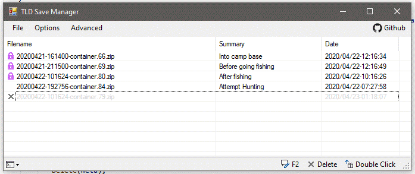

## TLD Save Manager

Allows to backup/restore saves in Survival mode of The Long Dark.

### Main features

- Automatic backup when a save is performed (Building entrance, Zone, main event...)
- Restore a backup to go back in time

### Features

- Add a Summary on backups
- Lock a backup
- Delete a backup. First, backups are hidden from the list and can be moved into RecycleBin
- Manual backup of the current save *(in case where automatic backup doesn't work)*

### Compatibility

- The Long Dark 1.74 (Microsoft Store / Xbox Play Anywhere version) 
- **Steam version is unsupported but contribution for compatibility is welcome**

### How to

- Run this program while TLD is running
- Every time TLD perform a save, it is backuped.
- When something occurs, you can still restore a backup.

